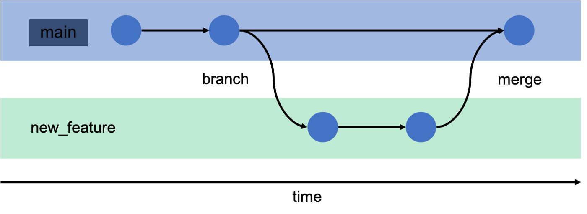

### Git Branch

Recording changes with the commit command, is what enables Git to solve one of the problems for which we use version control: going back in time and examining the state of the project at any point in the past. And it underpins the functionality that allows us to undo changes when necessary.

There is another important function that Git gives us: allowing more than one person to easily work on the same project. The feature that enables this is _branching_.



What is a branch? A branch is similar to a cloned repository &mdash; branching gives you a new copy of your project. Once you have branched, the changes you make do not effect your original working copy unless at some point you _merge_ them. If you delete a branch without merging its changes, then it is as if you never did any of the work.

Branches are _not_ cloned repositories &mdash; for one thing, there is a lot less overhead than a clone. But thinking of branches this way is a good metaphor to start with.

```
git branch experiment-1
```

We then need to specify that we want our changes to appear in this new branch

```
git checkout experiment-1
```

I'll add a file to this branch

```
// create a-new-file.txt using editor

git add a-new-file.txt
git commit -m "add file to branch"
```

Note that if we run the `branch` command without specifying a branch name, it will give us a list of all the branches in the repository

```
git branch

// output follows...
* experiment-1
  main
```

The `*` indicates the branch to which our changes will be committed.

But what's this `main`?

It turns out with Git, you're always working on _some_ branch. When we first created the repository, we were working on the default branch called, **main**. 

Let's switch back to it:

```
git checkout main
```

And if we list the files in our working copy, we see that `a-new-file.txt` is not there. This shouldn't be surprising: we didn't add it to the `main` branch.

#### Try it Together

Let's create a third branch: `experiment-2`:

```
git checkout -b experiment-2
```

The `-b` flag to the checkout command is a shortcut that combines the effects of creating a new branch and switching to it.

Will we see `a-new-file.txt` on this newly-created branch? List the directory and see!

Let's switch back to the main branch:

```
git checkout main
```

#### Your Turn

1. Create a new branch called `hotfix`
2. Add a file `patch.c` (_just put 1-2 lines of random text in it_) and commit it.
3. Switch back to the main branch. If you list the  directory, will `patch.c` be there?
4. Switch to the `experiment-2` branch. Which files will be there?

#### Further Reading

- https://www.atlassian.com/git/tutorials/using-branches

